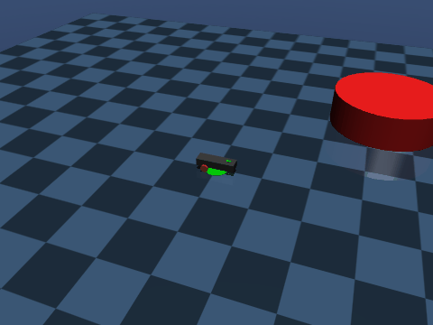
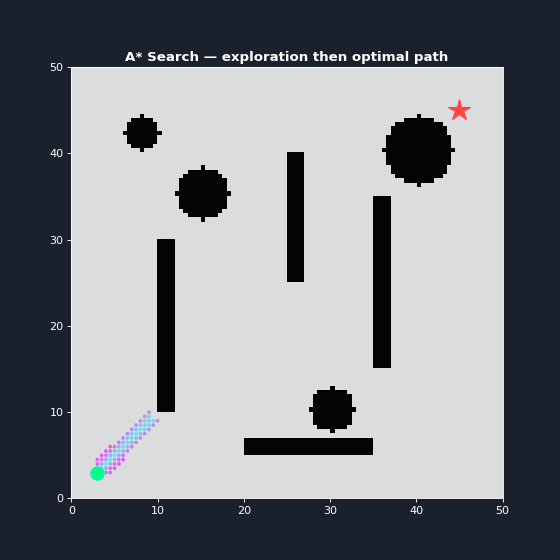
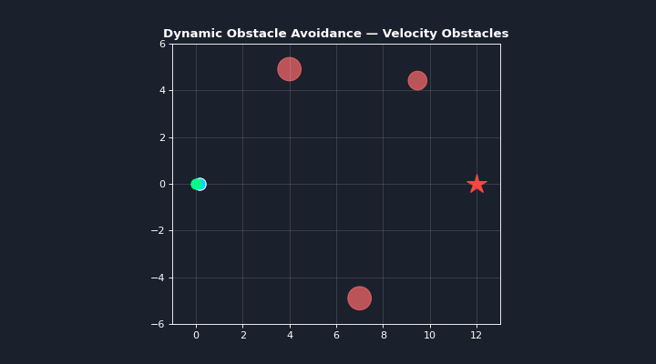
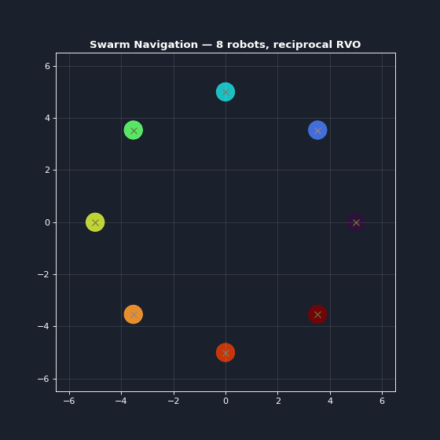
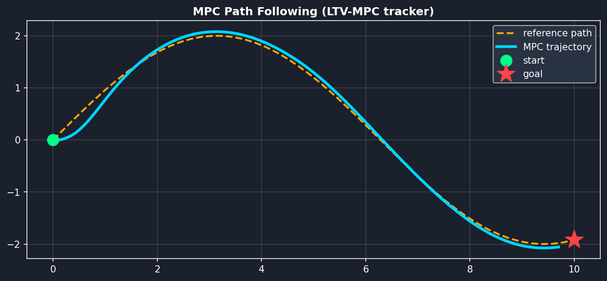
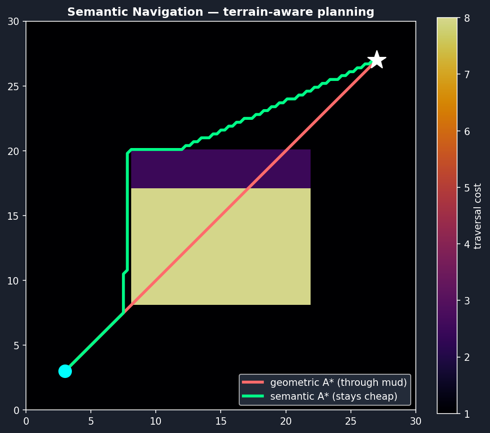
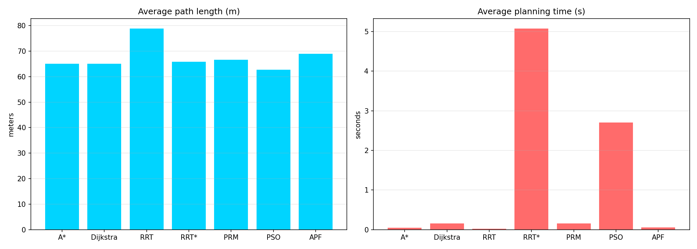
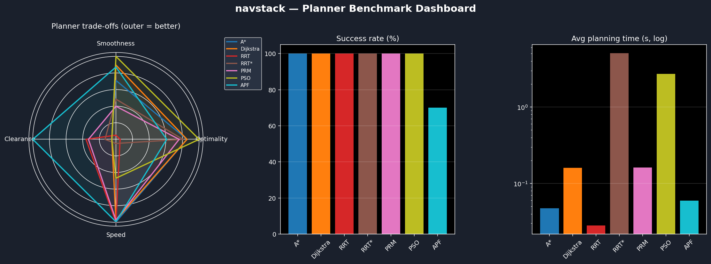

# navstack — Mobile Robot Navigation & Control Platform


**navstack** is a mobile-robot navigation and control platform: classical, sampling, optimization, and reactive **path planners**; a **MuJoCo physics simulator** across 6 drive types; trajectory-tracking **controllers** (Pure Pursuit / Stanley / DWA / **MPC**) and **dynamic obstacle avoidance** (Velocity Obstacles / RVO, incl. multi-robot swarms); and a self-balancing **Segway** stack with LQR / MPC / SMC / pole-placement / **RL (PPO)** control, plus LiDAR and vision perception.



## 🧭 Platform modules

| Module | What's inside |
|--------|---------------|
| `navstack.planners` | A\*, Dijkstra, RRT, RRT\*, PRM, PSO, APF, **semantic/terrain-aware A\*** (+ kinodynamic Hybrid A\* in `Trail/`) |
| `navstack.sim` | MuJoCo simulator + procedural MJCF generator for 6 drive types (diff 2WD/4WD, mecanum, omni-3, Ackermann, bicycle) |
| `navstack.controllers` | Pure Pursuit, Stanley, Proportional, DWA + GA auto-tuner; **Velocity Obstacles / RVO** dynamic avoidance |
| `navstack.balancing` | Self-balancing Segway: LQR / pole-placement / SMC / MPC / RL control, dynamics, region-of-attraction, Gym env + PPO training |
| `navstack.perception` | LiDAR raycasting + color-blob vision |
| `navstack.gui` | PySide6 control center |

 

 



## 🤖 Algorithms

| Algorithm | Type | Optimal | Description |
|-----------|------|---------|-------------|
| **A*** | Grid | ✅ | Optimal graph search with heuristic |
| **Dijkstra** | Grid | ✅ | Uniform cost search (no heuristic) |
| **RRT** | Sampling | ❌ | Rapidly-exploring Random Tree |
| **RRT*** | Sampling | ✅ | Optimal RRT with rewiring |
| **PRM** | Sampling | Local | Probabilistic Roadmap |
| **PSO** | Optimization | Local | Particle Swarm Optimization |
| **APF** | Reactive | ❌ | Artificial Potential Fields |

## 📁 Project Structure

```
navstack/                     # pip-installable platform package
├── planners/                 # A*, Dijkstra, RRT, RRT*, PRM, PSO, APF, semantic A*
├── controllers/              # Pure Pursuit, Stanley, DWA, MPC, Velocity Obstacles (RVO), swarm
├── sim/                      # MuJoCo sim + MJCF model generator (6 drive types)
├── balancing/                # self-balancing Segway: control, dynamics, ROA, RL
├── perception/               # LiDAR raycasting + color-blob vision
├── gui/                      # PySide6 control center
├── environment.py            # occupancy grid + collision checking
├── robot.py                  # differential-drive robot model
├── visualize.py              # dark-theme plotting utilities
├── benchmark.py              # reproducible benchmark harness
└── analytics.py              # benchmark analytics dashboard
examples/                     # runnable demos (compare_all, rvo, swarm, mpc, semantic, ...)
Trail/                        # kinodynamic Hybrid A* + DWA demo w/ moving obstacles
dashboard/                    # Streamlit interactive explorer
tests/                        # pytest suite (48 tests)
benchmarks/                   # benchmark results (CSV + summary plot)
media/                        # generated demo figures
```

## 🚀 Quick Start

After `pip install -e .` a `navstack` command is available:

```bash
navstack plan --algo RRT* --start 3,3 --goal 45,45   # run a planner on the demo map
navstack benchmark                                   # full benchmark
navstack dashboard                                   # analytics dashboard
navstack gui                                          # PySide6 control center (needs [sim])
```

```bash
pip install -e .                  # core planners (numpy/scipy/matplotlib)
pip install -e ".[sim,control,rl]"  # + MuJoCo sim, GUI, optimal control, RL

# Full comparison (all 7 algorithms)
python examples/compare_all.py

# Reproducible benchmark
python -m navstack.benchmark

# Dynamic obstacle avoidance + swarm + MPC tracking demos
python examples/rvo_demo.py
python examples/swarm_demo.py        # reciprocal-RVO multi-robot circle swap
python examples/mpc_demo.py          # LTV-MPC path following
python examples/semantic_demo.py     # terrain-aware (semantic) A* planning
python examples/mujoco_drive_gif.py  # 3D MuJoCo path-following render (needs [sim])

# Kinodynamic Hybrid A* + DWA demo with moving obstacles
python Trail/main.py

# MuJoCo multi-drive simulator GUI  (needs the [sim] extra)
python -m navstack.gui.control_center

# Self-balancing Segway: train / test the PPO controller  (needs [rl])
python -m navstack.balancing.train --test
```

## Tests

```bash
pip install -e ".[dev]"
pytest -q
```

## 📊 Algorithm Details

### Grid-Based Planners
- **A***: Uses Euclidean heuristic for faster optimal search
- **Dijkstra**: Explores uniformly without heuristic bias

### Sampling-Based Planners
- **RRT**: Fast exploration with random sampling
- **RRT***: Asymptotically optimal with tree rewiring
- **PRM**: Builds reusable roadmap for multiple queries

### Optimization & Reactive
- **PSO**: Smooth spline paths via particle optimization
- **APF**: Real-time reactive with potential fields

## 📈 Benchmarks

Run the reproducible benchmark harness (all planners × 10 scenarios: 2 fixed demo maps + 8 seeded random maps):

```bash
python -m navstack.benchmark   # writes benchmarks/results.csv + benchmarks/summary.png
```

Leaderboard (mean ± std over successful runs across 10 scenarios; planning times are machine-dependent):

| Planner | Success | Length (m) | Smoothness (°/wp) | Clearance (m) | Time (s) |
|---------|:-------:|:----------:|:-----------------:|:-------------:|:--------:|
| A*       | 10/10 | 65.07 ± 2.36 | 9.71 ± 3.78  | 1.01 ± 0.04 | 0.047 ± 0.027 |
| Dijkstra | 10/10 | 65.07 ± 2.36 | 4.29 ± 1.36  | 1.00 ± 0.00 | 0.160 ± 0.009 |
| RRT      | 10/10 | 78.78 ± 7.00 | 30.45 ± 4.95 | 1.50 ± 1.34 | 0.028 ± 0.041 |
| RRT*     | 10/10 | 65.87 ± 1.67 | 16.29 ± 5.54 | 1.18 ± 0.16 | 5.071 ± 0.419 |
| PRM      | 10/10 | 66.58 ± 1.88 | 18.80 ± 6.59 | 1.46 ± 0.38 | 0.162 ± 0.005 |
| PSO      | 10/10 | 62.72 ± 1.73 | 1.23 ± 0.97  | 1.01 ± 0.04 | 2.707 ± 0.038 |
| APF      |  7/10 | 68.98 ± 2.52 | 4.97 ± 6.19  | 2.39 ± 0.21 | 0.059 ± 0.006 |



Generate the analytics dashboard (radar of trade-offs + success/time panels) from the results:

```bash
python -m navstack.analytics            # -> media/benchmark_dashboard.png
python examples/make_gifs.py            # -> media/*.gif
streamlit run dashboard/streamlit_app.py  # interactive explorer (needs [dashboard])
```



Lower is better for every metric except *Success* and *Clearance*. A\*/Dijkstra are optimal and fast; PSO produces the shortest, smoothest paths but is slower; RRT\* trades time for quality over RRT; APF is fast and reactive but can get trapped in local minima.

## 🎯 Features

- ✅ 7 different planning algorithms
- ✅ Enhanced dark-theme visualization
- ✅ Algorithm-specific color schemes
- ✅ Path gradient effects and glow
- ✅ Robot simulation with trajectory tracking
- ✅ Performance metrics (time, path length)
- ✅ Modular, easy-to-extend design

